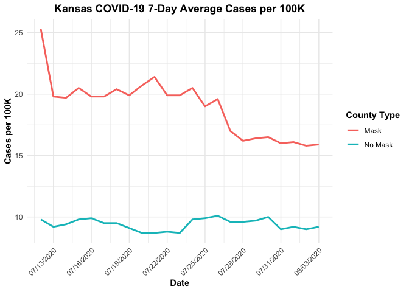
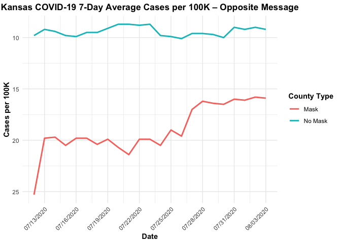

Lab 07 - Conveying the right message through visualisation
================
Verity Elliott
02_16_2026

### Load packages and data

``` r
library(tidyverse) 
```

### Exercise 1

The primary limitation of the original figure is its use of dual y-axes
with different numerical scales to display mask and non-mask counties.
The mask counties are plotted on a scale of approximately 15–26 cases
per 100,000, whereas the non-mask counties are plotted on a separate
4–14 scale. Because each series is scaled independently, the visual
slopes and relative distances between points are not directly comparable
across groups. This violates the principle of common scaling in
comparative graphics and increases the risk that viewers will
misinterpret similarity in visual pattern as similarity in magnitude or
rate of change.

A secondary issue (that irritated me to no end while working on this)
concerns the x-axis formatting. The date labels appear offset from their
corresponding tick marks, which reduces temporal precision and makes
day-specific comparisons more difficult. Although less consequential
than the scaling issue, this misalignment further diminishes
interpretability.

``` r
covid_data <- tribble(
  ~date,        ~county_type, ~cases_per_100k,
  "7/12/2020",  "Mask",       25.3,
  "7/12/2020",  "No Mask",    9.8,
  "7/13/2020",  "Mask",       19.8,
  "7/13/2020",  "No Mask",    9.2,
  "7/14/2020",  "Mask",       19.7,
  "7/14/2020",  "No Mask",    9.4,
  "7/15/2020",  "Mask",       20.5,
  "7/15/2020",  "No Mask",    9.8,
  "7/16/2020",  "Mask",       19.8,
  "7/16/2020",  "No Mask",    9.9,
  "7/17/2020",  "Mask",       19.8,
  "7/17/2020",  "No Mask",    9.5,
  "7/18/2020",  "Mask",       20.4,
  "7/18/2020",  "No Mask",    9.5,
  "7/19/2020",  "Mask",       19.9,
  "7/19/2020",  "No Mask",    9.1,
  "7/20/2020",  "Mask",       20.7,
  "7/20/2020",  "No Mask",    8.7,
  "7/21/2020",  "Mask",       21.4,
  "7/21/2020",  "No Mask",    8.7,
  "7/22/2020",  "Mask",       19.9,
  "7/22/2020",  "No Mask",    8.8,
  "7/23/2020",  "Mask",       19.9,
  "7/23/2020",  "No Mask",    8.7,
  "7/24/2020",  "Mask",       20.5,
  "7/24/2020",  "No Mask",    9.8,
  "7/25/2020",  "Mask",       19.0,
  "7/25/2020",  "No Mask",    9.9,
  "7/26/2020",  "Mask",       19.6,
  "7/26/2020",  "No Mask",    10.1,
  "7/27/2020",  "Mask",       17.0,
  "7/27/2020",  "No Mask",    9.6,
  "7/28/2020",  "Mask",       16.2,
  "7/28/2020",  "No Mask",    9.6,
  "7/29/2020",  "Mask",       16.4,
  "7/29/2020",  "No Mask",    9.7,
  "7/30/2020",  "Mask",       16.5,
  "7/30/2020",  "No Mask",    10.0,
  "7/31/2020",  "Mask",       16.0,
  "7/31/2020",  "No Mask",    9.0,
  "8/01/2020",  "Mask",       16.1,
  "8/01/2020",  "No Mask",    9.2,
  "8/02/2020",  "Mask",       15.8,
  "8/02/2020",  "No Mask",    9.0,
  "8/03/2020",  "Mask",       15.9,
  "8/03/2020",  "No Mask",    9.2
)

covid_data <- covid_data %>%
  mutate(date = as.Date(date, format = "%m/%d/%Y"))
```

### Exercise 2

The revised figure improves interpretability by plotting both mask and
non-mask counties on a single, common y-axis. By using one shared scale
for cases per 100,000, the slopes and vertical distances between the
lines are directly comparable across groups. This adheres to the
principle of common scaling in comparative data visualization and
reduces the risk of perceptual distortion introduced by dual-axis
graphics. Differences in magnitude and change over time can therefore be
evaluated visually without ambiguity.

In addition, the use of a single x-axis tied directly to the date
variable ensures that tick marks and labels correspond clearly to
specific time points. Combined with clear axis labels and a unified
legend distinguishing county type by color, the overall design improves
transparency, comparability, and interpretive accuracy relative to the
original figure.

``` r
ggplot(covid_data, aes(x = date, y = cases_per_100k, color = county_type)) +
  geom_line(size = 1) +
  labs(
    title = "Kansas COVID-19 7-Day Average Cases per 100K",
    x = "Date",
    y = "Cases per 100K",
    color = "County Type"
  ) +
  scale_x_date(
    limits = c(as.Date("2020-07-12"), as.Date("2020-08-03")),
    date_breaks = "3 days",
    date_labels = "%m/%d/%Y"
  ) +
  theme_minimal() +
  theme(
    plot.title = element_text(hjust = 0.5, face = "bold"),
    axis.title.x = element_text(face = "bold"),
    axis.title.y = element_text(face = "bold"),
    legend.title = element_text(face = "bold"),
    axis.text.x = element_text(angle = 45, hjust = 1)
  )
```

    ## Warning: Using `size` aesthetic for lines was deprecated in ggplot2 3.4.0.
    ## ℹ Please use `linewidth` instead.
    ## This warning is displayed once every 8 hours.
    ## Call `lifecycle::last_lifecycle_warnings()` to see where this warning was
    ## generated.

<!-- -->

### Exercise 3

The revised visualization makes it clearer that mask and non-mask
counties experienced substantially different COVID-19 case levels and
trends over the study period. Mask counties had a higher average 7-day
case rate (mean = 19.0 per 100K) compared with non-mask counties (mean =
9.4 per 100K), but cases in mask counties declined more sharply over
time (−9.4 per 100K) than in non-mask counties (−0.6 per 100K). This
pattern of relative magnitude and temporal change is evident in the
plot, whereas the original dual-axis graph obscured these differences by
using independent y-axes that distorted the visual comparison.

``` r
library(dplyr)

# Summary statistics by county type
covid_summary <- covid_data %>%
  group_by(county_type) %>%
  summarise(
    mean_cases = mean(cases_per_100k),
    min_cases = min(cases_per_100k),
    max_cases = max(cases_per_100k),
    sd_cases = sd(cases_per_100k),
    first_day = first(cases_per_100k),
    last_day = last(cases_per_100k),
    change = last_day - first_day
  )

print(covid_summary)
```

    ## # A tibble: 2 × 8
    ##   county_type mean_cases min_cases max_cases sd_cases first_day last_day change
    ##   <chr>            <dbl>     <dbl>     <dbl>    <dbl>     <dbl>    <dbl>  <dbl>
    ## 1 Mask              19.0      15.8      25.3    2.36       25.3     15.9 -9.4  
    ## 2 No Mask            9.4       8.7      10.1    0.446       9.8      9.2 -0.600

### Exercise 4

Based solely on the data and visualization, the plot shows that mask
counties had higher initial 7-day average case rates than non-mask
counties, but over the observed period, cases in mask counties declined
substantially (−9.4 per 100K), whereas cases in non-mask counties
remained relatively stable (−0.6 per 100K). This indicates that, during
this time frame, mask counties experienced a pronounced downward trend
in COVID-19 cases, while non-mask counties did not.

### Exercise 5

Well, I think I managed to answer this already…again. Nonetheless… The
accurate visualization conveys that mask counties experienced a sharper
decline in COVID-19 cases over the observed period compared with
non-mask counties. Key factors contributing to this message include the
use of a single y-axis for both county types, which allows direct
comparison of magnitude and trends; the variables plotted (7-day average
cases per 100K by county type and date), which clearly represent
differences in levels and temporal patterns; and the line plot format,
which emphasizes continuous change over time. Consistent x-axis spacing
with readable dates and clearly labeled axes further enhances
interpretability, making the differences between mask and non-mask
counties visually obvious.

### Exercise 6

For this opposite visualization, the goal is to convey the reverse of
the accurate message: that non-mask counties appear to have higher case
rates and mask counties appear to experience increases rather than
declines. To achieve this, the y-axis can be inverted so that declines
in mask counties appear as rises, and the relatively stable trend in
non-mask counties appears to fall. No additional data are required; the
same 7-day average cases per 100K for mask and non-mask counties is
used, but axis scaling dramatically changes the message a visualization
(apprears to) convey.

### Exercise 7

``` r
ggplot(covid_data, aes(x = date, y = cases_per_100k, color = county_type)) +
  geom_line(size = 1) +
  labs(
    title = "Kansas COVID-19 7-Day Average Cases per 100K – Opposite Message",
    x = "Date",
    y = "Cases per 100K",
    color = "County Type"
  ) +
  scale_x_date(
    limits = c(as.Date("2020-07-12"), as.Date("2020-08-03")),
    date_breaks = "3 days",
    date_labels = "%m/%d/%Y"
  ) +
  scale_y_reverse() +  # This inverts the y-axis
  theme_minimal() +
  theme(
    plot.title = element_text(hjust = 0.5, face = "bold"),
    axis.title.x = element_text(face = "bold"),
    axis.title.y = element_text(face = "bold"),
    legend.title = element_text(face = "bold"),
    axis.text.x = element_text(angle = 45, hjust = 1)
  )
```

<!-- -->
